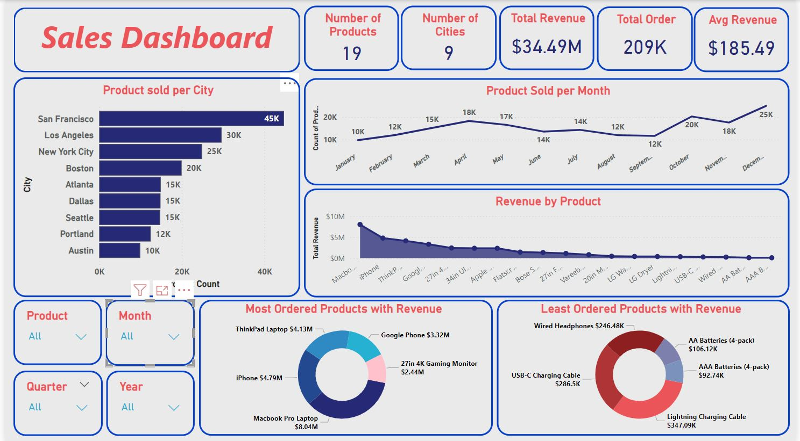

# Sales Analysis Dashboard Using MS Excel and Power BI

## Introduction
In today's highly competitive business landscape, analyzing sales performance has become crucial for achieving success. Sales data offers a wealth of valuable insights that go beyond mere numbers. It provides a comprehensive view of how a company is performing, highlighting strengths and pinpointing areas that require improvement. By thoroughly examining this data, businesses can identify trends, understand customer behavior, and gauge the effectiveness of their strategies. Moreover, these insights guide decision-making processes, allowing companies to implement targeted measures that enhance performance. From refining marketing efforts to optimizing product offerings, the ability to analyze and act upon sales data is essential for staying ahead in the market and driving sustainable growth.

## Project Objective:
This project aims to extract and visualize sales data insights, providing a comprehensive understanding of performance metrics. By identifying trends and top-selling products, the analysis will reveal consumer behavior patterns and key revenue metrics like total sales and profit margins. This information will help recognize profitable products, understand cost structures, and guide informed decision-making to optimize operations and enhance profitability.

# Data Collection and Sources
This section details the data collection process and provides insights into the dataset used for analysis.

## Data Source

- **Data source**: Provided as part of the MeriSKILL internship.

- **Dataset**: The dataset consists of 185,951 rows and 11 columns.

## Columns

The dataset includes the following columns:

1. **Order ID**
2. **Product Name**
3. **Quantity ordered**
4. **Price Each**
5. **Order date**
6. **Purchase address**
7. **Month**
8. **Sales**
9. **City**
10. **Hour**

These columns encompass essential information for analyzing sales and order details within the dataset.

# Data Pre-processing and Cleaning with MS Excel
The data pre-processing and cleaning phase involved several crucial steps to ensure the dataset's accuracy and readiness for analysis. Here is an overview of the procedures carried out:

## Steps

1. **Checking for Blank Values**: A thorough inspection was conducted to identify any blank values in the dataset. Fortunately, no missing values were found, indicating the dataset was complete.

2. **Splitting Date and Time**: The date and time information, initially combined in a single column, were separated into distinct columns. This separation facilitates more precise analysis and manipulation of temporal data.

3. **Converting Month Numbers to Month Names**: To enhance readability and interpretability, month numbers were converted into their corresponding month names. This change makes the data more user-friendly for subsequent analysis and reporting.

4. **Adjusting Data Types**: Proper data types were assigned to various columns to ensure accurate calculations and sorting. Specifically, currency columns were formatted as currency data types, and numeric columns were appropriately adjusted to their respective numerical formats.

5. **Sorting Data**: The dataset was organized by sorting the entries from newest to oldest based on the `ORDER DATE` column. This chronological ordering helps in analyzing trends and patterns over time.

6. **Exporting Cleaned Data**: After completing the cleaning process, the refined dataset was exported into two formats: CSV and Excel worksheet files. These formats were chosen to ensure compatibility with various data analysis tools and to facilitate easy sharing and further processing.

By following these steps, the dataset was meticulously prepared, ensuring it is reliable and ready for insightful analysis.

# Exploratory Data Analysis (EDA) using Power BI

This section details the comprehensive Exploratory Data Analysis (EDA) conducted using Microsoft Power BI. The process encompassed various steps to import, clean, explore, and analyze the dataset to derive meaningful insights.

## Steps for EDA using Power BI

### a. Importing Data into Power BI

1. **Select Import Data from Excel**: The initial step involved importing the dataset into Power BI by selecting the Excel file containing the data.

2. **Transform Data**: Utilizing the "Transform Data" option, additional data cleaning tasks were performed as necessary, including checking for empty values and ensuring data consistency.

3. **Close and Apply**: After completing data transformations, the changes were applied by selecting "Close and Apply" to finalize the data import process.

### b. Data Exploration

1. **Drag and Drop Columns**: Columns from the dataset were dragged and dropped from the Fields pane to explore various aspects of the data.

2. **Visualization Selection**: Various charts and visualizations were employed to identify key trends and patterns essential for the analysis.

### c. Basic Summary Statistics

1. **Using Cards for Summary Metrics**: Key metrics such as total quantity ordered, sales, average sales, number of unique products, and number of unique cities were calculated and displayed using the "Cards" visualization from the Visualizations tab.

### d. Univariate Analysis

1. **Bottom Five Products by Sales**: A column chart was created to visualize the bottom five products with the lowest sales amounts, indicating underperforming products compared to others.

2. **Top Five Products by Sales**: A doughnut chart highlighted the top five products with the highest sales amounts, showcasing top-performing products in terms of revenue generation.

3. **Products Ordered by City**: A bar chart depicted the quantity of products ordered from different cities, providing insights into regional sales patterns.

4. **Sales Revenue by City**: Another doughnut chart illustrated the distribution of sales revenue across various cities, highlighting cities contributing the most and least to overall revenue.

5. **Quantity of Products Ordered Over Time**: An area chart visualized the trends in product orders over months, revealing seasonal variations and trends in sales volume.

### e. Time Series Analysis

1. **Sales Trends Over Months**: A line chart was utilized to analyze sales trends over time, identifying patterns such as seasonal peaks and dips in sales activity.

### f. Slicers

1. **Interactive Data Filtering**: Two slicers were implemented to enable interactive filtering of data based on city and month, enhancing the ability to drill down into specific subsets of the dataset.

## Business Insights from Analysis
- **Total Sales and Revenue**: Approximately 209K products were sold, generating a total revenue of 34.49M with an average revenue of $185.49 per product.

- **Date Range**: Sales data spans from January 2019 to January 2020, providing a full year of sales information plus an additional month for year-over-year comparison.

- **City-wise Analysis**: Sales occurred in 9 major cities from January to December 2019, with San Francisco, Los Angeles, and New York City emerging as top revenue-generating cities.

- **Seasonal Sales Trends**: Monthly sales exhibited an upward trend from January to April, followed by seasonal variations until September. There was a notable increase in sales from September to October, tapering off towards November, and a resurgence in sales towards December.

- **Product Performance**: The MacBook Pro Laptop emerged as the top-selling product, generating 8M in revenue, while AAA Batteries recorded the lowest sales.

- **Top Performing Products**: The top five products by sales were MacBook Pro Laptop, iPhone, ThinkPad Laptop, Google Phone, and 27in 4K Gaming Monitor.

- **Least Performing Products**: Products such as Lightning Charging Cable, USB-C Charging Cable, Wired Headphones, AA Batteries, and AAA Batteries recorded the lowest sales figures, with AAA Batteries being the least-selling product.
- **Quarterly Trends**: In 2019, the business saw strong performance in Q4 with peak revenue and order volume attributed to holiday season sales. However, Q2 and Q3 showed declining monthly sales trends, suggesting a mid-year slump possibly influenced by seasonal patterns. Throughout the year, the product mix remained stable, with consistent top-selling and least-selling items. Geographically, San Francisco, Los Angeles, and New York City consistently led in sales across all quarters, highlighting stable regional performance.

These insights provide a comprehensive understanding of sales trends, product performance, and regional sales contributions, aiding in strategic decision-making and future planning.

## Recommendations

1. **Product Mix Optimization:**
   - **Action:** Focus on promoting top-selling products like MacBook Pro Laptop, iPhone, and ThinkPad Laptop.
   - **Why:** These products generate significant revenue and should be prioritized in marketing efforts.

2. **Regional Focus:**
   - **Action:** Increase marketing and sales efforts in cities like San Francisco, Los Angeles, and New York City.
   - **Why:** These cities consistently contribute the most to revenue, indicating strong market presence and potential for growth.

3. **Seasonal Strategies:**
   - **Action:** Plan promotional campaigns around seasonal sales trends, especially during peak months like October and December.
   - **Why:** Capitalizing on seasonal buying patterns can boost sales and revenue during specific periods.

4. **Inventory Management:**
   - **Action:** Monitor and manage inventory levels of underperforming products such as AAA Batteries.
   - **Why:** Minimize stock of low-selling items to reduce storage costs and focus on items with higher turnover.

5. **Data-driven Decision Making:**
   - **Action:** Continue leveraging data analytics tools like Power BI for ongoing analysis and real-time insights.
   - **Why:** Continuous monitoring allows for agile decision-making and adaptation to changing market conditions.

By implementing these recommendations and leveraging the insights gained, the business can optimize sales strategies, improve profitability, and maintain a competitive edge in the market.

## Dashboard 
The image above shows a sample sales dashboard displaying key metrics and trends extracted from the sales data analysis.

 

## Limitations

A significant limitation was the absence of customer information, which hindered the ability to adopt customer-centric approaches for identifying product preferences among different age groups or specific needs.

## Future Scope

Future analyses could benefit from incorporating customer-centric data collection methods, such as age, career, or preferences. This would enable more precise customer segmentation and potentially expand the product range to better match specific customer preferences.

## Conclusion

The analysis of tech product sales data provided valuable insights into product performance and ordering trends across various cities. The primary objective was to extract insights through thorough analysis and visualization, uncovering trends, top-selling items, total sales, and profit margins. These findings were derived from effective data visualization, providing actionable recommendations.

